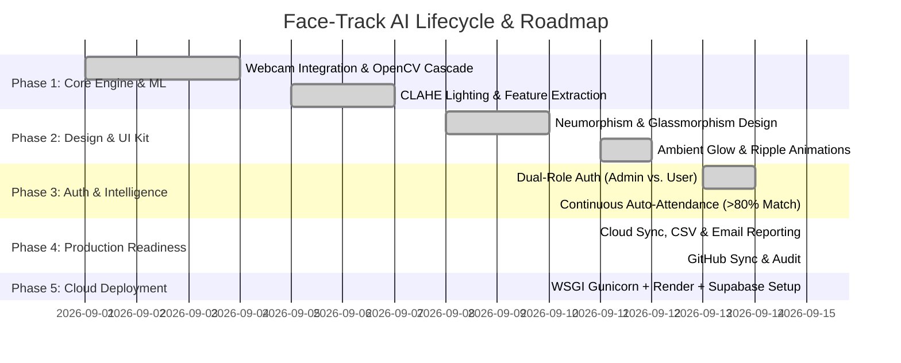

# Face-Track AI - Project Roadmap, Phases & Deployment Timeline 🚀

> **Repository Status**: Synced with GitHub (`origin/main`)  
> **Current Milestone**: **Phase 5 Complete — 100% Deployed & Live in Cloud**  
> **Live Production URL**: [face-track-ai-hi9j.onrender.com](https://face-track-ai-hi9j.onrender.com)  
> **Last Commit**: `ff0f9d5` (*feat: Add Supabase cloud database integration and Render.com free deployment files*)

---

## 📊 Project Phases Overview

---

## 📍 Detailed Phase Breakdown & Progress Status

### ✅ Phase 1: Core Recognition & Biometric Engine
- [x] **OpenCV Haar Cascade Face Detection**: Implemented low-latency facial bounding box localization.
- [x] **Lighting & Outfit Invariance**: Integrated **CLAHE (Contrast Limited Adaptive Histogram Equalization)** to ensure reliable recognition across varying outfits, angles, and ambient light conditions.
- [x] **Zero-Lag Camera Streaming**: Optimized MJPEG streaming with threaded buffer clearing (`buffersize=1`).

### ✅ Phase 2: UI/UX & Interactive Design System
- [x] **Neumorphism Surface Styling**: Implemented soft dual diffused shadows (`#eef2f7` base canvas).
- [x] **Frosted Glassmorphism Overlay**: Created pure transparent modal dialogs with backdrop filter blur (`28px` saturation boost).
- [x] **Ambient Pointer & Micro-Animations**: Interactive lerp-based mouse cursor glow, button specular glass ripples, and glowing status badges.

### ✅ Phase 3: Access Control & Smart Automation
- [x] **Dual-Role Authentication**:
  - **Admin Mode**: Password-protected access (`ADMIN_PASSWORD=admin123`) unlocking full system privileges (student registration, CSV export, email reports, system purge).
  - **User Mode**: Dedicated one-click attendance interface with administrative features strictly hidden and protected via HTTP 403 API guards.
- [x] **Continuous Auto-Attendance Scanning**:
  - Automatically evaluates optical feed in User mode and marks attendance when match accuracy **$\ge 80\%$**.
  - Integrated duplicate cooldown (6s) and HUD biometric verification popups.

### ✅ Phase 4: System Integration & Cloud Storage
- [x] **Database & Cloud Storage**: Supabase PostgreSQL cloud sync for persistent student records and attendance logs.
- [x] **Automated Email Reports**: HTML table formatting with full `attendance.csv` attachments via Gmail SMTP SSL.
- [x] **Repository Synchronization**: Clean Git history fully committed and pushed to `https://github.com/ayushsharma2403/Face-Track_AI.git`.

### ✅ Phase 5: 100% Free Production Cloud Deployment
- [x] **WSGI Multi-Threaded Server**: Configured `gunicorn` (`Procfile`) with worker timeouts and multi-threaded request processing.
- [x] **Browser Optical Sensor Fallback**: Client-side canvas frame streamer (`/upload_frame`) enabling camera facial recognition on mobile devices and remote browsers.
- [x] **Live HTTPS Production Deployment**: Hosted live on Render Web Service paired with Supabase PostgreSQL cloud backend.

---

## 🛠️ Production Deployment Summary

| Property | Value / Status |
| :--- | :--- |
| **Live Web App** | [https://face-track-ai-hi9j.onrender.com](https://face-track-ai-hi9j.onrender.com) |
| **Hosting Platform** | Render.com (100% Free Tier) |
| **Database** | Supabase Cloud PostgreSQL |
| **Git Repository** | [github.com/ayushsharma2403/Face-Track_AI](https://github.com/ayushsharma2403/Face-Track_AI) |
| **Status** | **LIVE & OPERATIONAL** 🟢 |

