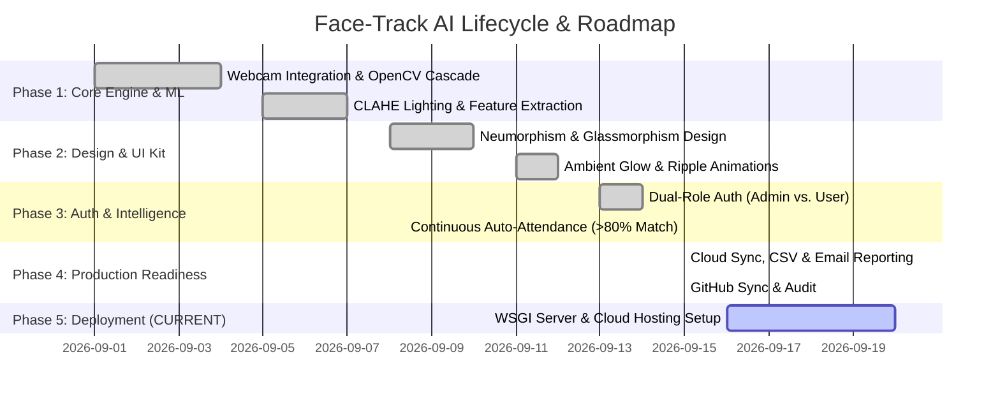

# Face-Track AI - Project Roadmap, Phases & Deployment Timeline 🚀

> **Repository Status**: Synced with GitHub (`origin/main`)  
> **Current Milestone**: **Phase 4 Complete — Ready for Deployment Phase**  
> **Last Commit**: `6a269d0` (*docs: Update README.md and .env.example with dual-role auth and auto-attendance documentation*)

---

## 📊 Project Phases Overview

---

## 📍 Detailed Phase Breakdown & Progress Status

### ✅ Phase 1: Core Recognition & Biometric Engine
- [x] **OpenCV Haar Cascade Face Detection**: Implemented low-latency facial bounding box localization.
- [x] **Lighting & Outfit Invariance**: Integrated **CLAHE (Contrast Limited Adaptive Histogram Equalization)** to ensure reliable recognition across varying outfits, angles, and ambient light conditions.
- [x] **Zero-Lag Camera Streaming**: Optimized MJPEG streaming with threaded buffer clearing (`buffersize=1`).

### ✅ Phase 2: UI/UX & Interactive Design System
- [x] **Neumorphism Surface Styling**: Implemented soft dual diffused shadows (`#eef2f7` base canvas).
- [x] **Frosted Glassmorphism Overlay**: Created pure transparent modal dialogs with backdrop filter blur (`28px` saturation boost).
- [x] **Ambient Pointer & Micro-Animations**: Interactive lerp-based mouse cursor glow, button specular glass ripples, and glowing status badges.

### ✅ Phase 3: Access Control & Smart Automation
- [x] **Dual-Role Authentication**:
  - **Admin Mode**: Password-protected access (`ADMIN_PASSWORD=admin123`) unlocking full system privileges (student registration, CSV export, email reports, system purge).
  - **User Mode**: Dedicated one-click attendance interface with administrative features strictly hidden and protected via HTTP 403 API guards.
- [x] **Continuous Auto-Attendance Scanning**:
  - Automatically evaluates optical feed in User mode and marks attendance when match accuracy **$\ge 80\%$**.
  - Integrated duplicate cooldown (6s) and HUD biometric verification popups.

### ✅ Phase 4: System Integration & GitHub Synchronization
- [x] **Database & Cloud Storage**: Supabase integration alongside local CSV database fallback.
- [x] **Automated Email Reports**: HTML table formatting with full `attendance.csv` attachments via Gmail SMTP SSL.
- [x] **Repository Synchronization**: Clean Git history fully committed and pushed to `https://github.com/ayushsharma2403/Face-Track_AI.git`.

---

## 🟢 CURRENT STEP: Phase 5 — Deployment Phase

We are officially ready to commence **Phase 5 (Production & Cloud Deployment)**.

### 🎯 Next Objectives for Deployment:
1. **WSGI Server Configuration**:
   - Transition from Flask development server (`app.py`) to a multi-threaded production WSGI server (**Waitress** for Windows / **Gunicorn** for Linux).
2. **Containerization (Docker)**:
   - Create `Dockerfile` and `docker-compose.yml` bundling OpenCV dependencies and Flask server.
3. **Cloud Hosting Target Options**:
   - **Render / Railway / Render App Hosting**: Free/low-cost Web Service hosting with environment variables support.
   - **AWS EC2 / GCP Compute Engine**: VPS deployment for dedicated webcam RTSP or IP camera input streams.
4. **Environment & Security Hardening**:
   - Production Secret Keys & SSL Certificate setup (HTTPS for camera permissions).

---

## 🛠️ GitHub Branch & Commit Verification

| Property | Status / Details |
| :--- | :--- |
| **Local Branch** | `main` |
| **Remote Branch** | `origin/main` |
| **Sync Status** | **Up to date** (0 commits ahead/behind) |
| **Latest Commit Hash** | `6a269d0` |
| **Repository URL** | [github.com/ayushsharma2403/Face-Track_AI](https://github.com/ayushsharma2403/Face-Track_AI) |
